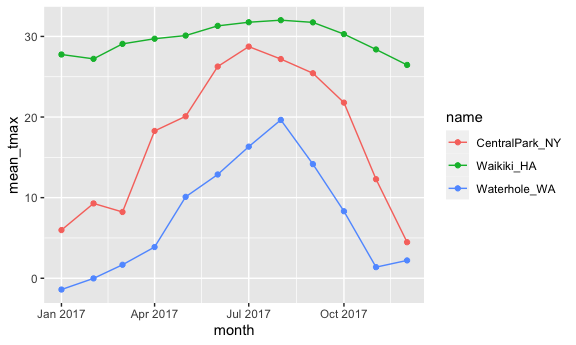
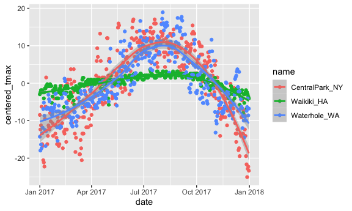

Exploratory data analysis
================

Load in a dataset that we’ll use often.

``` r
# Load packages
library(tidyverse)
```

    ## ── Attaching packages ─────────────────────────────────────── tidyverse 1.3.1 ──

    ## ✓ ggplot2 3.3.5     ✓ purrr   0.3.4
    ## ✓ tibble  3.1.4     ✓ dplyr   1.0.7
    ## ✓ tidyr   1.1.3     ✓ stringr 1.4.0
    ## ✓ readr   2.0.1     ✓ forcats 0.5.1

    ## ── Conflicts ────────────────────────────────────────── tidyverse_conflicts() ──
    ## x dplyr::filter() masks stats::filter()
    ## x dplyr::lag()    masks stats::lag()

``` r
library(viridis)
```

    ## Loading required package: viridisLite

``` r
library(ggridges)
library(patchwork)

# Set global options for embedding plots
knitr::opts_chunk$set(
      fig.width = 6,
      fig.asp = 0.6,
      out.width = "90%"
)

# Get data from NOAA and clean it up a bit

weather_df =  
  rnoaa::meteo_pull_monitors(
    c("USW00094728", "USC00519397", "USS0023B17S"),
    var = c("PRCP", "TMIN", "TMAX"), 
    date_min = "2017-01-01",
    date_max = "2017-12-31") %>%
  mutate(
    name = recode(
      id, 
      USW00094728 = "CentralPark_NY", 
      USC00519397 = "Waikiki_HA",
      USS0023B17S = "Waterhole_WA"),
    tmin = tmin / 10,
    tmax = tmax / 10,
    month = lubridate::floor_date(date, unit = "month")) %>%
  select(name, id, everything())
```

    ## Registered S3 method overwritten by 'hoardr':
    ##   method           from
    ##   print.cache_info httr

    ## using cached file: ~/Library/Caches/R/noaa_ghcnd/USW00094728.dly

    ## date created (size, mb): 2021-10-05 10:29:46 (7.602)

    ## file min/max dates: 1869-01-01 / 2021-10-31

    ## using cached file: ~/Library/Caches/R/noaa_ghcnd/USC00519397.dly

    ## date created (size, mb): 2021-10-05 10:29:52 (1.697)

    ## file min/max dates: 1965-01-01 / 2020-02-29

    ## using cached file: ~/Library/Caches/R/noaa_ghcnd/USS0023B17S.dly

    ## date created (size, mb): 2021-10-05 10:29:54 (0.912)

    ## file min/max dates: 1999-09-01 / 2021-09-30

``` r
## Registered S3 method overwritten by 'hoardr':
##   method           from
##   print.cache_info httr
## using cached file: /Users/jeffgoldsmith/Library/Caches/R/noaa_ghcnd/USW00094728.dly
## date created (size, mb): 2020-09-25 14:56:47 (7.519)
## file min/max dates: 1869-01-01 / 2020-09-30
## using cached file: /Users/jeffgoldsmith/Library/Caches/R/noaa_ghcnd/USC00519397.dly
## date created (size, mb): 2020-09-25 14:56:52 (1.699)
## file min/max dates: 1965-01-01 / 2020-03-31
## using cached file: /Users/jeffgoldsmith/Library/Caches/R/noaa_ghcnd/USS0023B17S.dly
## date created (size, mb): 2020-09-25 14:56:54 (0.877)
## file min/max dates: 1999-09-01 / 2020-09-30
```

## `group_by`

``` r
weather_df %>% 
  group_by(name, month)
```

    ## # A tibble: 1,095 × 7
    ## # Groups:   name, month [36]
    ##    name           id          date        prcp  tmax  tmin month     
    ##    <chr>          <chr>       <date>     <dbl> <dbl> <dbl> <date>    
    ##  1 CentralPark_NY USW00094728 2017-01-01     0   8.9   4.4 2017-01-01
    ##  2 CentralPark_NY USW00094728 2017-01-02    53   5     2.8 2017-01-01
    ##  3 CentralPark_NY USW00094728 2017-01-03   147   6.1   3.9 2017-01-01
    ##  4 CentralPark_NY USW00094728 2017-01-04     0  11.1   1.1 2017-01-01
    ##  5 CentralPark_NY USW00094728 2017-01-05     0   1.1  -2.7 2017-01-01
    ##  6 CentralPark_NY USW00094728 2017-01-06    13   0.6  -3.8 2017-01-01
    ##  7 CentralPark_NY USW00094728 2017-01-07    81  -3.2  -6.6 2017-01-01
    ##  8 CentralPark_NY USW00094728 2017-01-08     0  -3.8  -8.8 2017-01-01
    ##  9 CentralPark_NY USW00094728 2017-01-09     0  -4.9  -9.9 2017-01-01
    ## 10 CentralPark_NY USW00094728 2017-01-10     0   7.8  -6   2017-01-01
    ## # … with 1,085 more rows

## count some things

``` r
weather_df %>% 
  group_by(name, month) %>% 
  summarize(n_obs = n())
```

    ## `summarise()` has grouped output by 'name'. You can override using the `.groups` argument.

    ## # A tibble: 36 × 3
    ## # Groups:   name [3]
    ##    name           month      n_obs
    ##    <chr>          <date>     <int>
    ##  1 CentralPark_NY 2017-01-01    31
    ##  2 CentralPark_NY 2017-02-01    28
    ##  3 CentralPark_NY 2017-03-01    31
    ##  4 CentralPark_NY 2017-04-01    30
    ##  5 CentralPark_NY 2017-05-01    31
    ##  6 CentralPark_NY 2017-06-01    30
    ##  7 CentralPark_NY 2017-07-01    31
    ##  8 CentralPark_NY 2017-08-01    31
    ##  9 CentralPark_NY 2017-09-01    30
    ## 10 CentralPark_NY 2017-10-01    31
    ## # … with 26 more rows

``` r
# Shortcut way
weather_df %>% 
  count(name, month)
```

    ## # A tibble: 36 × 3
    ##    name           month          n
    ##    <chr>          <date>     <int>
    ##  1 CentralPark_NY 2017-01-01    31
    ##  2 CentralPark_NY 2017-02-01    28
    ##  3 CentralPark_NY 2017-03-01    31
    ##  4 CentralPark_NY 2017-04-01    30
    ##  5 CentralPark_NY 2017-05-01    31
    ##  6 CentralPark_NY 2017-06-01    30
    ##  7 CentralPark_NY 2017-07-01    31
    ##  8 CentralPark_NY 2017-08-01    31
    ##  9 CentralPark_NY 2017-09-01    30
    ## 10 CentralPark_NY 2017-10-01    31
    ## # … with 26 more rows

It’s nice that summarize produces a data frame

`table` doesn’t, and that’s bad.

``` r
weather_df %>% 
  pull(name) %>% 
  table()
```

    ## .
    ## CentralPark_NY     Waikiki_HA   Waterhole_WA 
    ##            365            365            365

``` r
weather_df %>% 
  janitor::tabyl(month, name)
```

    ##       month CentralPark_NY Waikiki_HA Waterhole_WA
    ##  2017-01-01             31         31           31
    ##  2017-02-01             28         28           28
    ##  2017-03-01             31         31           31
    ##  2017-04-01             30         30           30
    ##  2017-05-01             31         31           31
    ##  2017-06-01             30         30           30
    ##  2017-07-01             31         31           31
    ##  2017-08-01             31         31           31
    ##  2017-09-01             30         30           30
    ##  2017-10-01             31         31           31
    ##  2017-11-01             30         30           30
    ##  2017-12-01             31         31           31

## More general summaries

Let’s count, take means, look at SDs…

``` r
weather_df %>% 
  group_by(name, month) %>% 
  summarize(
    n_obs = n(),
    # Could use na.rm, or drop_na earlier in tidying
    mean_tmax = mean(tmax, na.rm = TRUE),
    median_tmax = median(tmax, na.rm = TRUE),
    sd_tmax = sd(tmax, na.rm = TRUE)
  ) %>% 
  ggplot(aes(x = month, y = mean_tmax, color = name)) + 
  geom_point() + 
  geom_line()
```

    ## `summarise()` has grouped output by 'name'. You can override using the `.groups` argument.



Formatting table outputs…

``` r
weather_df %>% 
  group_by(name) %>% 
  summarize(
    n_obs = n(),
    mean_tmax = mean(tmax, na.rm = TRUE)
  ) %>% 
  knitr::kable(digits = 2)
```

| name            | n\_obs | mean\_tmax |
|:----------------|-------:|-----------:|
| CentralPark\_NY |    365 |      17.37 |
| Waikiki\_HA     |    365 |      29.66 |
| Waterhole\_WA   |    365 |       7.48 |

## grouped `mutate`

``` r
# Adding a column to the data frame in a way that is group specific
weather_df %>% 
  group_by(name) %>% 
  mutate(
    mean_tmax = mean(tmax, na.rm = TRUE),
    centered_tmax = tmax - mean_tmax
  ) %>% 
  ggplot(aes(x = date, y = centered_tmax, color = name)) + 
  geom_point() +
  geom_smooth()
```

    ## `geom_smooth()` using method = 'loess' and formula 'y ~ x'

    ## Warning: Removed 3 rows containing non-finite values (stat_smooth).

    ## Warning: Removed 3 rows containing missing values (geom_point).



``` r
# Coldest day in each place, use <2 or >2 because of ties
weather_df %>% 
  group_by(name) %>% 
  mutate(
    tmax_rank = min_rank(tmax)
  ) %>% 
  filter(tmax_rank < 2)
```

    ## # A tibble: 3 × 8
    ## # Groups:   name [3]
    ##   name           id          date        prcp  tmax  tmin month      tmax_rank
    ##   <chr>          <chr>       <date>     <dbl> <dbl> <dbl> <date>         <int>
    ## 1 CentralPark_NY USW00094728 2017-12-28     0  -7.7 -11.6 2017-12-01         1
    ## 2 Waikiki_HA     USC00519397 2017-12-21    18  21.7  18.3 2017-12-01         1
    ## 3 Waterhole_WA   USS0023B17S 2017-01-02    25 -10.5 -12.4 2017-01-01         1

``` r
# Warmest day in each place, use <2 or >2 because of ties
weather_df %>% 
  group_by(name) %>% 
  mutate(
    tmax_rank = min_rank(desc(tmax))
  ) %>% 
  filter(tmax_rank < 2)
```

    ## # A tibble: 4 × 8
    ## # Groups:   name [3]
    ##   name           id          date        prcp  tmax  tmin month      tmax_rank
    ##   <chr>          <chr>       <date>     <dbl> <dbl> <dbl> <date>         <int>
    ## 1 CentralPark_NY USW00094728 2017-06-13     0  34.4  25   2017-06-01         1
    ## 2 CentralPark_NY USW00094728 2017-07-20     3  34.4  25   2017-07-01         1
    ## 3 Waikiki_HA     USC00519397 2017-07-12     0  33.3  24.4 2017-07-01         1
    ## 4 Waterhole_WA   USS0023B17S 2017-08-03     0  26.4  13.3 2017-08-01         1

Note that different functions deal with ties in different ways.

Lagged variables:

``` r
weather_df %>% 
  group_by(name) %>% 
  mutate(
    # What is the tmax observation I had the day before?
    # To construct lag information, you should have the grouping structure in place, otherwise will inadvertently put things in the wrong order
    # Order that the dataframe is in makes a difference (e.g. dates arranged as they need to be for `lag`)
    lagged_tmax = lag(tmax, n = 1),
    tmax_diff = tmax - lagged_tmax
  ) %>% 
  summarize(diff_sd = sd(tmax_diff, na.rm = TRUE))
```

    ## # A tibble: 3 × 2
    ##   name           diff_sd
    ##   <chr>            <dbl>
    ## 1 CentralPark_NY    4.45
    ## 2 Waikiki_HA        1.23
    ## 3 Waterhole_WA      3.13

## Limitations

What if my “summary” is a linear model …

``` r
weather_df %>% 
  group_by(name) %>% 
  summarize(cor_tmin_tmax = cor(tmin, tmax, use = "complete"))
```

    ## # A tibble: 3 × 2
    ##   name           cor_tmin_tmax
    ##   <chr>                  <dbl>
    ## 1 CentralPark_NY         0.955
    ## 2 Waikiki_HA             0.638
    ## 3 Waterhole_WA           0.939

``` r
weather_df %>% 
  # Cannot replace this with group_by and then try to run linear models on each place, since in one data frame
  filter(name == "CentralPark_NY") %>% 
  lm(tmax ~ tmin, data = .)
```

    ## 
    ## Call:
    ## lm(formula = tmax ~ tmin, data = .)
    ## 
    ## Coefficients:
    ## (Intercept)         tmin  
    ##       7.209        1.039

``` r
# This doesn't work because lm must be a vector, not an lm object
weather_df %>% 
  group_by(name) %>% 
  summarize(lm = lm(tmax ~ tmin))
```
